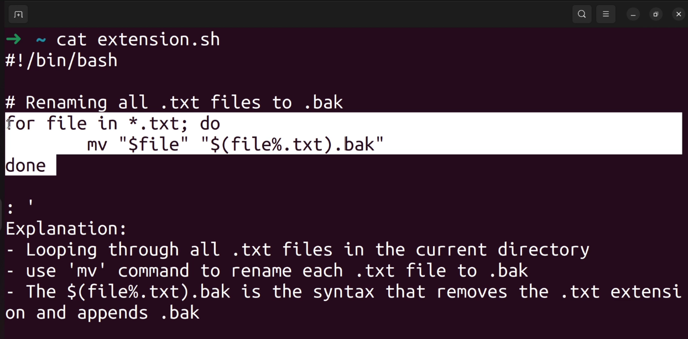
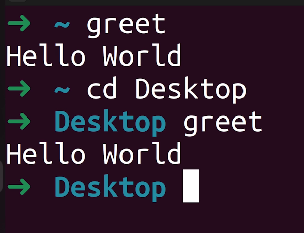
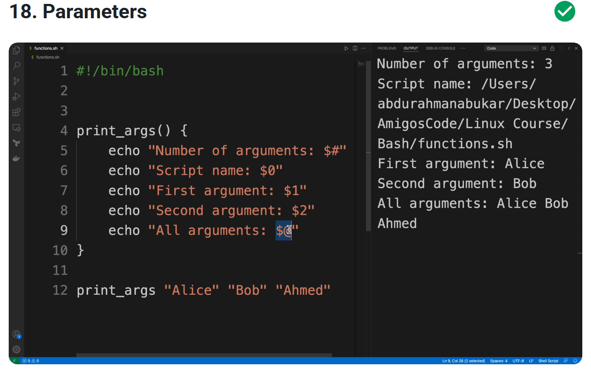

# CoderCo Bash Scripting module exercises



Understanding ${file%.txt}
`${file%.txt}` is a Bash expression that removes the .txt part from a filename.

Think of it as:

${file} → This means the full filename.
% → This means remove something from the end of the filename.
.txt → This is what we are removing.


## Running scripts from *anywhere*

- You need to place your script in one of the directories that's in your PATH environment variable
- PATH = an environment variable that tells the shell which directories to search for exec files in respect to commands

- if you run echo $PATH:

$ echo $PATH
/c/Users/hrahm/bin:/mingw64/bin:/usr/local/bin:/usr/bin:/bin:/mingw64/bin:/usr/bin:/c/Users/hrahm/bin:/c/Program Files/Common Files/Oracle/Java/javapath:/c/WINDOWS/system32:/c/WINDOWS:/c/WINDOWS/System32/Wbem:/c/WINDOWS/System32/WindowsPowerShell/v1.0:/c/WINDOWS/System32/OpenSSH:/c/Terraform:/cmd/bin:/bin:/c/Program Files/nodejs:/c/Program Files/Amazon/AWSCLIV2:/c/Program Files/Docker/Docker/resources/bin:/c/Program Files:/c/Program Files/Java/jdk-17/bin:/c/Users/hrahm/AppData/Local/Coursier/data/bin:/c/Program Files/MongoDB/Server/8.0/bin:/c/Program Files/mongosh-2.3.4-win32-x64/bin:/c/Program Files/Redis:/c/Program Files/stockfish:/c/Program Files/elasticsearch-8.16.1/bin:/c/Users/hrahm/AppData/Local/Programs/Python/Python312/Scripts:/c/Users/hrahm/AppData/Local/Programs/Python/Python312:/c/Users/hrahm/AppData/Local/Programs/Python/Launcher:/c/Users/hrahm/AppData/Local/Microsoft/WindowsApps:/c/Users/hrahm/AppData/Local/Programs/Microsoft VS Code/bin:/c/Users/hrahm/AppData/Roaming/npm:/c/Program Files/nodejs:/c/Users/hrahm/scala-cli:/c/Users/hrahm/AppData/Roaming/Code/User/globalStorage/github.copilot-chat/debugCommand:/usr/bin/vendor_perl:/usr/bin/core_perl:/c/Repositories/LinuxBash/LinuxBashFundamentals/Bash/bin

- you can place your script in any of these directories can be run from ANYWHERE in the terminal
- a common directory to place user scripts is usr/local/bin

### How do i move a file to a PATH directory?
- use: sudo mv script-name.sh /usr/local/bin/script-name
- note that 'mv' can be used to rename a file too
- note that '.sh' has been removed for easier usage


### Why sudo?
- you need to use sudo because you need *_super user permissions*_ to move scripts into these directories


### How do you make it exectutable?

- chmod +x script-name.sh


## Variables

- assignment operator = assigning a value to a variable
- variables are not restricted to a specific data type; they're dynamic so can be used for a variety of things
- variables can store values for strings, numbers and arrays (see [var.sh](./var.sh))


## Arithmetic expansion calculations

- can perform mathematical calcs and evaluate expressions using the $ and (( )) notations 
- allows flexibility and dynamic scripts (see [arithmetic.sh](./arithmetic.sh) and [arithmetic2.sh](./arithmetic2.sh))
- arithmetic with parameters allows scripts to be even more dynamic see [arithmetic.sh](./arithmetic3.sharith)


## While loops

Below is the basic structure of a while loop:  

```
#!/bin/bash  # Use Bash to run this script

variable(s)

while [ condition ]
do
    # Code to be executed
done  
```

### Now let's work through an example:

```
#!/bin/bash  # Use Bash to run this script

fruits=("apple" "banana" "orange")  # Create an array of fruits
index=0  # Start at the first item (position 0)

while [ $index -lt ${#fruits[@]} ]  # Loop while index is less than the number of fruits
do
    echo "Fruit: ${fruits[$index]}"  # Print the fruit at position "index"
    ((index++))  # Increase index by 1
done  # End of loop
```

#### **Understanding This Bash Script Step by Step (For Beginners)**  

This script **prints a list of fruits, one by one**. Let’s go through it slowly and explain each part in **plain English**.

---

## **Step 1: The First Line (`#!/bin/bash`)**
```bash
#!/bin/bash
```
- This line **tells the system** that this script should be run using **Bash** (the shell interpreter).
- Every Bash script **starts with this line**.

---

## **Step 2: Creating a List (Array) of Fruits**
```bash
fruits=("apple" "banana" "orange")
```
- We create a **list** (also called an **array**) and name it `fruits`.
- This list contains **three items**: `"apple"`, `"banana"`, and `"orange"`.
- Arrays in Bash store multiple values inside **one variable**.

---

## **Step 3: Setting Up a Counter**
```bash
index=0
```
- We create a **counter** named `index` and set it to **0**.
- This counter **keeps track of which fruit we are printing**.

---

## **Step 4: Setting Up a `while` Loop**
```bash
while [ $index -lt ${#fruits[@]} ]
```
- `while` means: **"Keep repeating the following steps until a condition is false."**
- `[ $index -lt ${#fruits[@]} ]` checks **if the counter (`index`) is less than the number of fruits**.
  - `${#fruits[@]}` **counts the number of items** in the `fruits` array.
  - `-lt` means **"less than"**.
- The loop will **run until all fruits are printed**.

### **What This Condition Means in Plain English**
- If `index = 0`, check: **"Is 0 less than 3?"** → **Yes** ✅ → Run the loop.
- If `index = 1`, check: **"Is 1 less than 3?"** → **Yes** ✅ → Run the loop.
- If `index = 2`, check: **"Is 2 less than 3?"** → **Yes** ✅ → Run the loop.
- If `index = 3`, check: **"Is 3 less than 3?"** → **No** ❌ → **Stop the loop**.

---

## **Step 5: Printing the Fruit Name**
```bash
echo "Fruit: ${fruits[$index]}"
```
- `${fruits[$index]}` means:  
  - **Get the fruit at position `index`** in the list.
  - The first time (`index = 0`), this is **"apple"**.
  - The second time (`index = 1`), this is **"banana"**.
  - The third time (`index = 2`), this is **"orange"**.
- The `echo` command prints the fruit.

**Example Output:**
```
Fruit: apple
Fruit: banana
Fruit: orange
```

---

## **Step 6: Increasing the Counter**
```bash
((index++))
```
- This **adds 1 to the `index` variable**.
- The next time the loop runs, it **moves to the next fruit**.

---

## **Step 7: Ending the Loop**
```bash
done
```
- This marks the **end of the `while` loop**.
- The loop **runs again** until all fruits are printed.

---

## **Step-by-Step Execution of the Script**
| **Iteration** | **Index Value (`index`)** | **Condition (`index < 3`)?** | **Printed Output** | **What Happens Next?** |
|--------------|-----------------|-----------------|-----------------|-----------------|
| 1st loop | `0` | ✅ Yes (0 < 3) | `Fruit: apple` | `index` becomes `1` |
| 2nd loop | `1` | ✅ Yes (1 < 3) | `Fruit: banana` | `index` becomes `2` |
| 3rd loop | `2` | ✅ Yes (2 < 3) | `Fruit: orange` | `index` becomes `3` |
| 4th loop | `3` | ❌ No (3 < 3 is false) | **Loop stops** | **Script ends** |

---

## **Final Output**
```
Fruit: apple
Fruit: banana
Fruit: orange
```
---

## **What You Learned**
✅ How to **create an array** (list) in Bash.  
✅ How to **use a loop** to go through each item in an array.  
✅ How to **print each item** one by one.  
✅ How to **increase a counter** inside a loop.  

Now you can modify the script to loop through any list you want! 🚀


### **Difference Between `while` Loops and `for` Loops in Bash**  

#### **1. `while` Loops – Used When You Don’t Know How Many Times to Repeat**  
- **Runs as long as a condition is true.**  
- **Useful when the number of iterations is unknown.**  

**Example: Counting Until a Condition is Met**  
```bash
count=1
while [ $count -le 5 ]; do
    echo "Count: $count"
    ((count++))
done
```
**Output:**  
```
Count: 1
Count: 2
Count: 3
Count: 4
Count: 5
```
- This loop **keeps running** until `count` reaches `5`.  
- **Condition-controlled loop.**  

---

#### **2. `for` Loops – Used When You Know How Many Times to Repeat**  
- **Iterates over a list of items or a fixed range.**  
- **Useful when you know exactly how many times to loop.**  

**Example 1: Looping Over a List (Array)**
```bash
fruits=("apple" "banana" "orange")

for fruit in "${fruits[@]}"; do
    echo "Fruit: $fruit"
done
```
**Output:**  
```
Fruit: apple
Fruit: banana
Fruit: orange
```
- Runs **once for each item** in `fruits`.

**Example 2: Looping Over a Range of Numbers**
```bash
for i in {1..5}; do
    echo "Iteration: $i"
done
```
**Output:**  
```
Iteration: 1
Iteration: 2
Iteration: 3
Iteration: 4
Iteration: 5
```
- Runs **exactly 5 times**.

---

### **Key Differences**
| Feature | `while` Loop | `for` Loop |
|---------|------------|----------|
| **Usage** | When you **don't know** how many times it should run | When you **know** how many times it should run |
| **Condition-based?** | ✅ Yes | ❌ No |
| **Used for?** | Waiting for a condition to be met | Iterating over a list or range |
| **Example Use** | Keep checking a process status | Loop through a list of files |

**Quick Rule:**  
- Use `while` when **waiting for something to happen**.  
- Use `for` when **iterating over a known set of items**.


## Break and continue - can be used in for/while loops

break = stops the iteration  
continue = skips that specific iteration in the for/while loop


## Basics of Functions

- functions allow us to turn our code into modules, improve script organisation and enhance reusability
- therefore can use functions throughout our code
- they encapsulate a set of instructions that can be called and executed whenever needed

```
    #!/bin/bash

function_name() { #configuring the function and what code to run


    # code block to be executed
}

function_name #calling the function using the name given and outputs the greeting when invoked
```

- functions can also accept parameters which allows us to pass data to them, making them more dynamic and reusable (see [functions2.sh](functions2.sh))

### Recap

- functions are defined using function_name followed by () and then curly braces {} and the code is encapsulated in the braces
- functions can be called using the function_name
- we can accept parameters to make them more dynamic and reusable


## Parameters in Functions



- parameters allow us to pass data to functions making them more versatile and adaptable
- function parameters provide a way to pass data to functions, enabling them to perform specific tasks based on provided inputs
- different types of parameters:  
    - *positional parameters*
    - *special parameters*

### Positional parameters example:
```
greet_person() {              # second function
    local name="$1"           # a local variable called name and make that equal to the first element passed in as a paramter
    echo "Hello name: $name!"
```

- we are defining a function called `greet-person` that accepts a positional parameter `name`
- the value of the positional parameter is stored in a `local variable` called name
- and the function uses it to greet the person
- we can call the function with different arguments/parameters i.e. Ahmed and Sam (see [functions2.sh](./functions2.sh)) providing the necessary data for them to operate on


### Special parameters: `$#, $0, $#`

- these can also be accessed in functions
```
#!/bin/bash

print_args() {
    echo "Number of arguments: $#"
    echo "Name of script: $0"
    echo "First argument: $1"
    echo "Second argument: $2"
    echo "All arguments: $@"
}

print_args "Alice" "Bob" "Ahmed"
```

## User inputs in functions (see [user-inputs](./user-inputs.sh))

- user input allows our script to interact with users, making them more dynamic and responsive

```
#!/bin/bash

greet_user() {
    echo "What is your name?" # ask the user for their name
    read name                # reads the user's input and store it in the variable name. Without read, the script wouldn't be able to capture what the user types.
    echo "Hello $name!"      # print out the user's name they have provided
}

greet_user
```

### Why do we need the read?
- Without read, the script wouldn't be able to capture what the user types.
- This pauses the script and waits for the user to type something.
- The text the user enters gets stored in the variable name.
- If we remove this line, the script will not capture any input.
- we can also incorporate user inputs and parameters into a script see [user.inputs2.sh](./user-inputs2.sh)


## Handling bad data - see [handling-bad-data.sh](./handling-bad-data.sh)

- Focussing on handling bad data in functions
- bad data could be unexpected user inputs that may cause errors or undesired behaviours in your bash scripts
- by implementing proper error handling techniques, can ensure functions handle bad data and provide informative feedback to the user
- can achieve this using conditional statements to check validity of the input entered

### Input sanitisation - see [input-sanitisation.sh](./input-sanitisation.sh)

- another technique to handle bad data; input sanitisation - see [input-sanitisation.sh](./input-sanitisation.sh)
- this involves cleaning and transforming user inputs to ensure user inputs meet the required format or constraints


## Piping within functions

_This script **counts the number of files in a given directory** and prints the result._

---

### **Line-by-Line Breakdown**

#### **1. The Shebang Line**
```bash
#!/bin/bash
```
- This tells the system to **run the script using Bash**.
- It should always be the **first line** of a Bash script.

---

#### **2. Defining a Function**
```bash
get_file_count() {
```
- This **defines a function** named `get_file_count`.  
- A function **groups commands together** so you can call them later.

---

#### **3. Storing the First Input Argument in a Variable**
```bash
local directory=$1
```
- **`$1`** represents the **first argument** passed to the function.
- The `local` keyword means the variable **only exists inside the function**.
- This stores the **directory name** provided when calling the function.

✅ **Example:**  
If you call `get_file_count "./documents"`, then:  
- `$1` becomes `"./documents"`
- `directory="./documents"`

---

#### **4. Declaring Another Variable**
```bash
local file_count
```
- Creates an **empty variable** named `file_count`.  
- It will later store the **number of files in the directory**.

---

#### **5. Counting the Number of Files**
```bash
file_count=$(ls "$directory" | wc -l)
```
- `ls "$directory"` → **Lists** all files in the directory.  
- `wc -l` → **Counts the number of lines** (which represents the number of files).  
- `$( ... )` → **Captures** the output of the command and stores it in `file_count`.

✅ **Example:**  
If the directory contains **5 files**, `ls "$directory" | wc -l` outputs `5`, so:  
- `file_count=5`

---

#### **6. Printing the Result**
```bash
echo "Number of files in $directory: $file_count"
```
- `echo` prints the **number of files** in the directory.

✅ **Example Output:**
```
Number of files in ./documents: 5
```

---

#### **7. Calling the Function**
```bash
get_file_count "./"
```
- This **calls** the `get_file_count` function and passes `"./"` as the directory.
- `"./"` means **the current directory**.

✅ **If the current folder has 10 files, the output will be:**
```
Number of files in ./: 10
```

---

### **Final Recap**
| **Line** | **What It Does** |
|----------|-----------------|
| `#!/bin/bash` | Runs the script using Bash. |
| `get_file_count() {` | Defines a function named `get_file_count`. |
| `local directory=$1` | Stores the first argument (`$1`) as `directory`. |
| `local file_count` | Declares an empty variable `file_count`. |
| `file_count=$(ls "$directory" | wc -l)` | Counts the number of files in `directory`. |
| `echo "Number of files in $directory: $file_count"` | Prints the file count. |
| `get_file_count "./"` | Calls the function for the current directory (`./`). |


